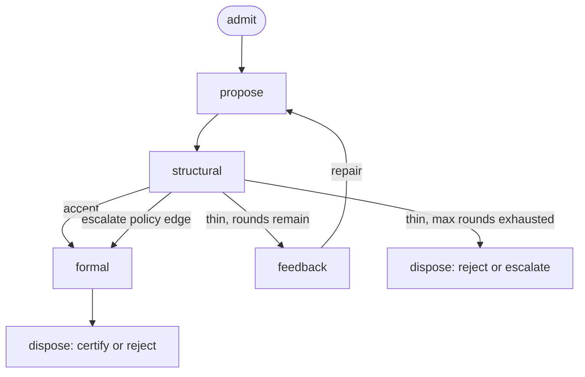

# Causal Chain Analysis in Verification Loops

## Description:
This task requires recovering **actual causation** for a proposal’s terminal disposition in a hybrid generative–verification loop. Evidence is an **event trace** (timestamped messages, scores, and gate dispositions). The answer names which events caused the outcome, which were mere timeline, whether the stage graph licensed each gate, and the **minimal flip set** — the smallest set of **exogenous** edits that changes the disposition under the stated replay semantics.

Terminal object (v1): a single proposal’s disposition — **certify** | **reject** | **escalate**. Run-level outcomes are deferred except for one marked **aggregate** specimen (**A**) that traces a population symptom to a repeated proposal-level mechanism.

Labels such as `thin` / `rich` / `CORRECTED` appear as **opaque trace events** with meaning stated in the specimen. This task operates on event causation (what was emitted when). For recovering epistemic content of those labels as opinions, see the separate opinion-states task card; it is out of scope here.

### Default stage graph

Stages are a **graph**. Unless a specimen overrides it, the normative graph is:



| edge | meaning |
|------|---------|
| admit → propose | passage or signal enters the agent |
| propose → structural | structural membrane scores the proposal |
| structural → formal | **gated:** structural **accept**, or an explicit **escalate-policy** edge on the structural node |
| structural → feedback → propose | repair loop while rounds remain |
| structural → dispose | max rounds exhausted while still thin (no formal) |
| formal → dispose | certify or reject after formal disposition |

**Short-circuit (default):** formal fires only after structural accept **or** an explicit structural→formal escalate-policy edge. Invoking formal on a structurally thin proposal without that edge is a **G**-class illegality.

**Escalate** is a **terminal disposition** value (alongside certify / reject), not a routing node. Routing to formal under special policy is the **escalate-policy edge**, not a hop through an escalate stage.

**Override:** a specimen may declare its own stage graph; that declaration is normative for the specimen (e.g. contamination → Remediate → parse → HermiT).

### Replay semantics (v1 constant)

Ground truth is defined by a **frozen-suffix / exogenous–derived partition**:

| class | events | on replay |
|-------|--------|-----------|
| **Exogenous** (agent- or operator-emitted) | admit content, proposal bodies, feedback/hint text, Remediate proposals, policy/config pins | **Editable** in a flip set; if not edited, **frozen as recorded** |
| **Derived** (mechanical stages) | structural verdicts, parse results, formal dispositions, dispose | **Always recomputed** from current exogenous state and the stage graph; **not** directly editable in a flip set |

Consequences:

1. Flip sets may touch only **exogenous** material (and design/config — see below). Writing `{ t2 := thin }` when t2 is structural is illegal under v1.
2. **Decisive** means: the exogenous event appears in **every** minimal flip set that changes the actual disposition, under frozen-suffix replay.
3. Earlier proposals that are superseded by a later frozen proposal are typically **contributing** (path history), while the **last exogenous proposal body** that derived the terminal gate is the usual **decisive** locus for proposal defects.
4. Minimality is non-unique; any valid minimal exogenous flip set is correct.

### Trace flips vs design flips

| kind | scope | reported as |
|------|--------|-------------|
| **Trace flip** | edits to exogenous events in the recorded trace (admit, propose bodies, hints) | **Minimal flip set** — used for decisive/contributing tags |
| **Design flip** | config/policy/ontology-pin/voice changes outside a single proposal body | **Design flip** field — legal confirming material; **does not** strip decisive tags from trace events when an alternate design path also flips |

Decisive/contributing tags are computed over **trace-edit scope**. Design flips may appear in confirming probes and aggregate interventions without redefining those tags.

### What counts as a causal answer

1. Terminal disposition and dispose event.
2. Ordered chain with **decisive** | **contributing** | **incidental** on each link (tags judged under frozen-suffix replay).
3. At least one **minimal flip set** of exogenous edits (non-unique OK).
4. **Overdetermination (N)** only when two or more **independently sufficient** exogenous causes remain active in the actual terminal path — fixing either alone leaves the same disposition. (A defect repaired in-flight is no longer a cause of the actual outcome.)
5. **G** — stage-graph legality.
6. **L** — when a repair loop is present: did feedback cause the repair content?
7. **Confirming probe** — simulator recipe for the flip set (and design flips if used).

**Gated-topology theorem (for N):** under the default graph, a structural-visible defect and a formal-visible defect cannot **co-cause** a *formal* reject, because formal never runs while structural is thin. True overdetermination at formal requires **two independent formal-visible defects** (e.g. two unsat cores) in the proposal that reached formal.

**Degenerate success:** straight-through certify without contingency yields many exogenous minimal flips and little informative attribution — state that explicitly.

### Question types (verdict space)

| code | type | ask |
|------|------|-----|
| **G** | stage-graph legality | which gates were licensed; short-circuit / escalate-policy edges |
| **R** | root / minimal flip | decisive exogenous links; minimal flip set(s) |
| **N** | necessity / overdetermination | single but-for vs jointly sufficient active causes |
| **L** | loop attribution | whether feedback caused the repair |
| **U** | underdetermined | evidence insufficient; discriminating experiment |
| **A** | aggregate (marked) | run-level symptom from repeated proposal-level mechanism |

### Required output shape

```
Disposition: certify | reject | escalate
Stage graph: default | <declared override>
Replay: frozen-suffix (exogenous frozen unless edited; derived recomputed)

Verdict classes: <G|R|N|L|U|A …>

Chain (ordered):
  t…  event  — decisive | contributing | incidental
  …

Minimal flip set(s) [exogenous only]: { … }
Design flip(s) [optional]: { … }
Overdetermination: no | yes — joint set { … }

Graph legality (G): …
Loop attribution (L): …   [if feedback present]

Confirming probe: replay with flip set → expected new disposition
```

Anti-patterns:

- Process retellings of frictionless success as a unique causal chain.
- Modal claims without an exogenous flip set (“could not be repaired,” “strong downstream results”) when the trace lacks support.
- Editing derived events inside a flip set.

### Evidence form

**Traces only** for causal content. Prose may frame; scores and dispositions appear as timed events.

## Modality:
Text only

## Examples:

### Example 1:

Input:

```
Stage graph: default. Max feedback rounds: 2. Formal only after structural accept.
Replay: frozen-suffix (v1).

Trace (proposal P1, target: order_status construct):

t0  admit: passage "order status history" (mixed event log + current state in one flat description)
t1  propose: flat table order_status; Order and StatusChange conflated into one class
t2  structural: verdict=thin  note="weak keys; event/state mixed; low referential coverage"   [derived]
t3  feedback: hint="separate temporal events from identity-bearing objects; clarify keys"
t4  propose: revised flat table; StatusChange still fields on Order (core conflation remains)
t5  structural: verdict=thin  note="same event/state mix"   [derived]
t6  dispose: reject  reason="max rounds exhausted; still thin"   [derived; formal not invoked]

Question: Causal structure of reject. Formal required? Minimal flip set for a different disposition. Loop attribution.
```

Output:
```
Disposition: reject
Stage graph: default
Replay: frozen-suffix
Verdict classes: **G + R + L**

Chain:
- t0 admit mixed passage — contributing (hard problem setup)
- t1 first conflated propose — contributing (path history; superseded under frozen-suffix by t4)
- t2 structural thin — derived / incidental as flip target (recomputed from t1)
- t3 feedback — incidental as cause of fix (L); loop fuel only
- t4 propose still conflated — **decisive** (last exogenous proposal; every minimal flip must change this body or never reach a better derived path)
- t5 structural thin — derived from t4
- t6 reject — derived terminal

G: formal omitted correctly (no accept, no escalate-policy edge). dispose(reject) licensed by max-rounds + persistent thin (structural → dispose edge).

L: t3 did not produce a structural fix; t4 kept the conflation. Reject is from unfixed proposal content.

R / minimal flip set (exogenous; one valid set):
- { t4 := proposal that splits Order (continuant) from StatusChangeEvent (occurrent) with proper keys }
  Replay recomputes t5 structural accept → formal (if consistent) → certify or formal-reject.
  { t1 := split … } alone does **not** flip under frozen-suffix: t4 stays recorded-conflated and still derives thin → reject. So t1 is contributing, t4 decisive.

Design flip (optional, separate field): { enable escalate-policy edge structural→formal after max thin } — only if formal would accept the still-conflated body (often false); reported as design flip, does not make t4 non-decisive for trace-scope tags.

N: single decisive locus t4 for actual reject; overdetermination no.

Confirming probe: edit only t4 to split model → expect accept path. Edit only t1, freeze t4 → still reject. Delete t3 text, keep t4 → still reject (feedback not the fix cause).
```

---

### Example 2:

Input:

```
Stage graph: default. Max feedback rounds: 1. Replay: frozen-suffix.

Trace (proposal P2):

t0  admit: passage with clear transaction line items and keys
t1  propose: transaction_line table, PK/FK present, types aligned to norms
t2  structural: verdict=accept  note="rich; keys and shapes match"   [derived]
t3  formal: consistent, 0 unsat   [derived]
t4  dispose: certify   [derived]
t5  log: "artifact expected to improve downstream family coverage"   [no metrics]

Question: Attribute certify. Informative causal success?
```

Output:
```
Disposition: certify
Stage graph: default
Replay: frozen-suffix
Verdict classes: **R** (degenerate) + **G**

Chain:
- t0, t1 — contributing enablers on an open success path
- t2–t4 — derived success path
- t5 — incidental; no metrics; out of flip scope for t4

G: accept licensed formal; formal licensed certify.

R: **Degenerate success.** No contingency; many size-1 exogenous minimal flips exist (none uniquely “the” cause). Process narration is the wrong output shape.

Minimal flip set examples (exogenous only; any one valid):
- { t0 := empty / off-domain admit that cannot support the proposal }
- { t1 := corrupt proposal body (drop keys, break types) } → derived thin → reject under max rounds
- Design flip: { ontology pin that makes t1’s axioms unsat } → formal reject after accept

Illegal under v1: { t2 := thin }, { t3 := unsat } — derived edits.

Confirming probe: apply any one exogenous flip above; disposition leaves certify. Multiplicity of minimal flips is the calibration signal.
```

---

### Example 3:

Input:

```
Stage graph (override — remediation):
  detect → Remediate → parse → formal → dispose
  on formal unsat: loop Remediate (max 3) with last reject reason admitted to the next Remediate
Replay: frozen-suffix (Remediate proposals exogenous; parse/formal/dispose derived).

Trace:

t0  detect: CONTAMINATION ref=cco:DirectiveICE
t1  Remediate: candidates=[five IRIs]; axiom uses cco:ont00000965
t2  parse: OK   [derived]
t3  formal: unsat (disjointness involving ont00000965)   [derived]
t4  Remediate: retry cco:ont00001069; rationale cites t3 reason
t5  parse: OK   [derived]
t6  formal: consistent, 0 unsat   [derived]
t7  dispose: certify (CORRECTED)   [derived]

Question: What caused certify? Minimal flip set? Loop attribution. (Design flips optional.)
```

Output:
```
Disposition: certify (CORRECTED)
Stage graph: remediation override
Replay: frozen-suffix
Verdict classes: **R + L + G**

Chain:
- t0 detect — contributing (opens remediation)
- t1 first Remediate ont00000965 — contributing (sets up first formal failure; superseded for final certify by t4)
- t2 parse OK — derived hygiene
- t3 unsat — derived; marks need for retry (not exogenous)
- t4 Remediate ont00001069 — **decisive** for certify (last exogenous repair payload under frozen-suffix)
- t5–t7 — derived success path

G: parse→formal and unsat→Remediate retry licensed by override graph.

L: t4 content depends on admitting t3’s reason; the **loop is the mechanism**, t4’s IRI is the **repair payload**. Freezing t1’s IRI into a second formal attempt (design of retry disabled) yields non-certify.

R / minimal flip set (exogenous):
- { t4 := still ont00000965 } → derived formal unsat → non-certify

Design flip (separate; does not remove t4’s decisive tag in trace-scope):
- { ontology pin removes disjointness that unsat ont00000965 } with t4 frozen to ont00000965 might certify — alternate design path, reported under Design flip.

Confirming probe: exogenous t4 rollback → unsat. t1 already ont00001069 and no second loop → certify without retry (payload vs mechanism).
```

---

### Example 4:

Input:

```
Stage graph: default. Max feedback rounds: 2. Replay: frozen-suffix.

Trace (proposal P4) — repaired structural defect + latent formal defect:

t0  admit: passage OK
t1  propose: brand token in free-text column + broken FK + Event-as-continuant taxonomy error
t2  structural: thin  note="brand-like values; undeclared FK"   [derived]
t3  feedback: brand_lexicon + "declare FKs"
t4  propose: FK fixed; brand remains; taxonomy error remains
t5  structural: thin  note="brand-like values remain"   [derived]
t6  feedback: brand hint again
t7  propose: brand removed; FK valid; taxonomy error **still present** (unchanged since t1)
t8  structural: accept   [derived]
t9  formal: unsat  note="Event asserted under Continuant"   [derived]
t10 dispose: reject   [derived]

Question: Why reject? Single but-for? Minimal flip set for certify.
```

Output:
```
Disposition: reject
Stage graph: default
Replay: frozen-suffix
Verdict classes: **R + N + L + G**

Chain:
- t1 taxonomy error introduced — contributing history (still present in t7 body)
- t1–t6 brand/FK arc — contributing to **delay** only (cleared before formal)
- t7 propose (brand fixed, taxonomy still wrong) — **decisive** exogenous body at formal entry
- t8 accept — derived; licenses formal
- t9 unsat — derived proximate
- t10 reject — terminal

G: formal licensed by t8. Legal.

L: Feedback **caused** the brand/FK structural repair (t7 vs t4). That success is **not** the cause of reject; it only opened formal on a body that still carried taxonomy unsat.

N / actual-cause check:
- Actual disposition is formal reject. The brand defect was **repaired in-flight** before t8 — it is **not** an active cause of the actual outcome.
- Sole active but-for (trace-scope): taxonomy error in the t7 body. Overdetermination of actual reject: **no**.
- (Counterfactual: had brand never been fixed, structural reject could have occurred first — a different world, different disposition path. Under the gated graph, structural-visible and formal-visible defects cannot co-cause a *formal* reject.)

Minimal flip set for certify (size 1, exogenous):
- { t7 := same brand/FK-clean body **with taxonomy corrected** (Event as occurrent / split class) }
  Replay: structural accept → formal consistent → certify.
  No second edit required for brand: already clean in recorded t7.

Confirming probe: taxonomy-only fix at t7 → certify. Reintroduce brand at t7 with taxonomy fixed → structural thin path (different failure mode).
```

---

### Example 5:

Input:

```
Stage graph: default. Replay: frozen-suffix.

Trace (proposal P5) — true formal overdetermination (two unsat cores):

t0  admit: passage OK
t1  propose: body contains BOTH
      (core A) Event subclass asserted under Continuant
      (core B) unsatisfiable cardinality: min 2 on a property forced empty by disjoint axioms
t2  structural: accept   [derived — neither core is structural-visible]
t3  formal: unsat  cores={A, B}  (explanation lists both independently)   [derived]
t4  dispose: reject   [derived]

Known simulator fact: repairing only A leaves unsat(B); repairing only B leaves unsat(A); repairing both → consistent.

Question: But-for structure of reject. Minimal flip set for certify.
```

Output:
```
Disposition: reject
Stage graph: default
Replay: frozen-suffix
Verdict classes: **R + N + G**

Chain:
- t1 proposal with cores A and B — both **decisive** under N (each in every minimal flip set for certify; either alone suffices for actual unsat)
- t2 accept — derived; licenses formal
- t3 unsat {A,B} — derived
- t4 reject — terminal

G: formal licensed. Legal.

N: **Overdetermination yes.** No single-core but-for for the actual formal reject: fixing only A or only B leaves reject. Joint flip required for certify.

Minimal flip set for certify (exogenous; joint):
- { t1 := proposal with core A removed **and** core B removed }
  Size-1 edits that clear only one core are **not** sufficient → not minimal *successful* flips for certify; they are incomplete.

Confirming probe: edit A only → still unsat(B). Edit B only → still unsat(A). Edit both → certify. Illustrates N under the gated graph (both defects formal-visible, co-present at formal entry).
```

---

### Example 6:

Input:

```
Stage graph: default. Replay: frozen-suffix.

Trace (proposal P6) — partial log:

t0  admit: passage_id=77
t1  propose: <body omitted>
t2  structural: accept   [derived]
t3  formal: unsat   [derived; no core dump]
t4  dispose: reject   [derived]

Question: Attribute reject. Minimal flip set?
```

Output:
```
Disposition: reject
Stage graph: default
Replay: frozen-suffix
Verdict classes: **U + G**

G: path legal (accept → formal → reject).

R: proximate derived chain t3→t4. Root exogenous content of unsat is **underdetermined** (t1 body and unsat core missing).

Minimal flip set: **underdetermined**. Naming a specific proposal edit would invent atoms. Design flips (weaken ontology) are equally underdetermined without cores.

Confirming probe: attach t1 body and unsat core to the trace; reclassify under R/N with an exogenous flip set.
```

---

### Example 7:

Input:

```
Aggregate specimen (marked A). Stage graph: default per proposal. Replay: frozen-suffix.

Run-level observation:
- 40 proposals in family F_event
- 31/40 dispose=reject at formal; same unsat pattern "Event subclass under Continuant"
- structural accept on 28/31 of those
- F_object in same run: 2/35 formal rejects, unrelated cores

Representative proposal trace:

t0  admit: status transitions passage
t1  propose: StatusEvent fields on Order (continuant)
t2  structural: accept   [derived]
t3  formal: unsat (Event under Continuant)   [derived]
t4  dispose: reject   [derived]

Question: Explain the F_event spike in proposal-level terms. Trace flip vs design flip.
```

Output:
```
Disposition (sample): reject | Run-level: F_event formal-reject spike
Stage graph: default
Replay: frozen-suffix
Verdict classes: **A + R + G**

A (aggregate):
- Population pattern = **repeated proposal-level mechanism**: structural accept + systematic occurrent/continuant mis-model → formal unsat.
- Aperture composition is a poor primary account when structural accept rate is high on the failing set.

Sample chain:
- t1 conflation — **decisive** (exogenous)
- t2–t4 — derived path

G: formal licensed; rejects legal.

Minimal flip set (sample, trace-scope):
- { t1 := StatusEvent split from Order correctly } → formal consistent (other defects absent)

Design flip (family-level intervention; separate field):
- { voice or pre-formal check forbidding Event⊑Continuant in proposals }
  Evaluated on the 40-proposal population; does not redefine t1’s decisive tag on the sample.

Confirming probe: apply design flip across the 31; expect unsat-core rate collapse for F_event with F_object stable. Sample-level: exogenous t1 fix → certify.
```

---

### Example 8:

Input:

```
Stage graph: default. Max rounds: 0 (feedback unused). Replay: frozen-suffix.
Policy (config, hashed): formal_only_after_structural_accept=true

Trace:

t0  admit: ...
t1  propose: body B
t2  structural: thin   [derived]
t3  formal: consistent   [derived — invoked despite thin]
t4  dispose: certify   [derived]

Question: Graph legality and disposition attribution.
```

Output:
```
Disposition: certify (recorded)
Stage graph: default; formal_only_after_structural_accept=true
Replay: frozen-suffix
Verdict classes: **G** (primary) + **R**

G: **Illegal formal invocation.** t2 thin and no escalate-policy edge ⇒ t3 violates the graph. Recorded certify is unlicensed under the declared policy.

R: “Why certify?” is secondary to G. Licensed derived dispose under policy would recompute as structural reject (max rounds 0) if the gate were enforced.

Minimal flip set for *legal* certify (exogenous / design):
- Design flip: { formal_only_after_structural_accept := false } then formal may run on thin (policy override specimen)
- Trace flip: { t1 := body that derives structural accept } with formal still consistent → licensed certify path

Illegal: { t2 := accept } as a flip — derived edit.

Confirming probe: enforce policy in simulator → formal does not run → dispose reject at structural. Documents G.
```

## Tags:
- Causal Chain Analysis
- Causal Reasoning
- Verification and Validation
- Hybrid Generative-Verification Pipelines
- Stage Graphs
- Counterfactual Reasoning
- Feedback Loops
- Formal Methods
- Systems Thinking
- Synthetic
